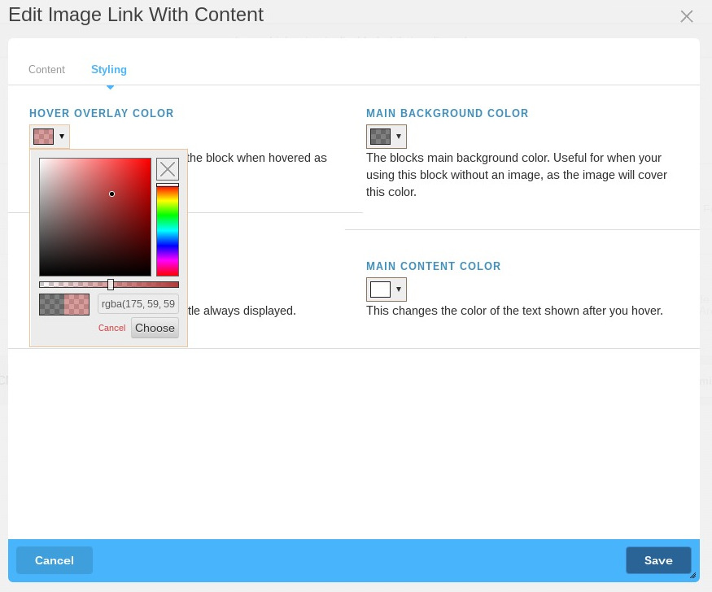

    

<h4 align="center">
    Image Link With Content is a Concrete5 add-on
</h4>

    Displays an image and content within an internal link.

    

<article class="markdown-body">
    <h1>Introduction</h1>
    
Simple to use block.  Includes preset layout and functionality, with the ability for you to add your own content and image and set the blocks colors to your desire.

    <h1>How To Use This Block</h1>
    
After adding this block to a page, you will be presented with the blocks form where you may:

    <ul>
        <li>
            
Add a title:

            
        </li>
        <li>
            
Add some text content:

            
        </li>
        <li>
            
Provide the background image (although the block works fine without one):

            
        </li>
        <li>
            
Select an internal link (althought the block works fine without one):

            
        </li>
        <li>
            
Provide a custom sub title under content:

            
        </li>
        <li>
            
Last but not least, change the colors presented when the block is hovered, as well as the color of the content that shows up.

        </li>
    </ul>
    <h1>Changing Colors</h1>
    
    
To change colors of elements displayed by the block, click the Styling tab where you will be presented with the color selectors that change the colors used by the block.  A short description of which color you are changing appears below each color.

</article>
Live example coming soon
